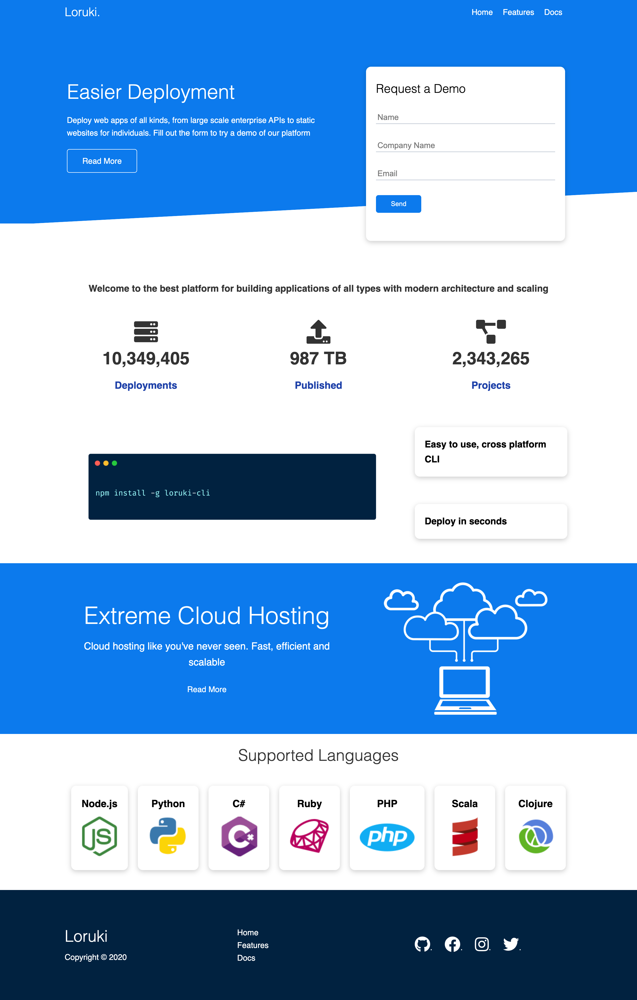

# Loruki Rebuild

> Loruki is a website providing cloud based hosting services to individuals and
> entrepreneurs. In this project, we are trying to recreate the Loruki website.

## Table of contents

- [Loruki](#Loruki)
  - [Table of contents](#table-of-contents)
  - [Screenshots](#screenshots)
  - [Technologies](#technologies)
  - [Setup](#setup)
  - [Team members](#team-members)

## Screenshots

## Technologies

> Technology we use to rebuild this website

- HTML5
- CSS3
- Markdown
- Git

> Method

- Agile development

## Setup
>For anyone who is interested in viewing this project, you could:
* Click on the link on the right side of the page, right below settings button.
* You could also clone the repo and view it with live server in vscode.

## Team members

- [Marina](https://github.com/marina-bashlak)
- [Xin](https://github.com/XinGITLou)
- [Neha](https://github.com/Neha-2012)
- [Belkis](https://github.com/blksck)
